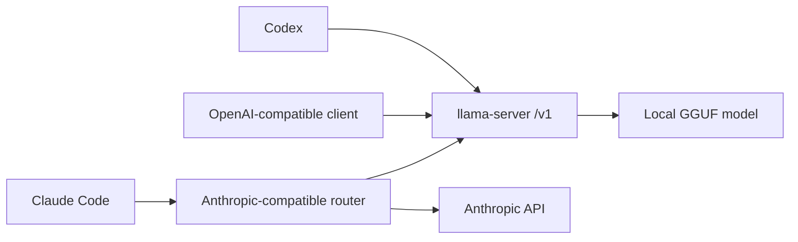

# Local Agent Routing

This guide describes how `ofxGgmlLlama` can participate in hybrid coding-agent
setups without owning every client integration.

`ofxGgmlLlama` provides local llama.cpp endpoints, model discovery, server
lifecycle scripts, and focused validation. Codex, Claude Code, Copilot, custom
routers, and future agent addons can consume those endpoints.

## Boundary

Keep this addon in the local inference lane:

- OpenAI-compatible `llama-server` endpoints for text, chat, embeddings, and
  coding-agent helper tasks.
- GGUF model discovery and truthful local aliases.
- Server startup, health checks, and smoke validation.
- Documentation for connecting external clients.

Do not move client-specific orchestration into this addon:

- Anthropic Messages API emulation belongs in an optional proxy/router.
- Multi-step planning and tool-loop ownership belongs in agent/router addons.
- Retrieval storage and indexing policy belongs in `ofxGgmlRag`.
- Audio transcription belongs in the audio/Whisper lane.

## Client Shapes

| Client | Endpoint shape | Recommended path |
| --- | --- | --- |
| OpenAI Codex | OpenAI-compatible Responses API | Direct `llama_cpp` provider profile |
| GitHub Copilot or similar clients | OpenAI-compatible endpoint when supported | Direct `llama-server` URL |
| Claude Code | Anthropic-compatible Messages API | Proxy via `ANTHROPIC_BASE_URL` |
| Custom agents | Whatever the agent owns | Use local endpoint helpers per task |

Codex can use the local endpoint directly because the addon config presents a
named OpenAI-compatible provider. Claude Code needs a proxy because
`llama-server` does not expose Anthropic's Messages API.



## Routing Policy

Route only bounded, low-risk work to local models:

| Task | Local target | Fallback |
| --- | --- | --- |
| Embeddings and RAG indexing | Embedding server or `ofxGgmlRag` | Cloud embedding API |
| Intent classification | Small local text/chat model | Frontier model |
| Entity extraction | Local text/chat model with strict output | Frontier model |
| Short context summaries | Local text/chat model | Frontier model |
| Audio transcription | `ofxGgmlAudio` / Whisper lane | Cloud transcription API |

Keep complex coding, architecture decisions, security-sensitive changes, and
ambiguous user intent on the stronger reasoning model. A router should validate
local output shape, reject invalid categories or malformed JSON, and fall back
when confidence is low.

## Codex Direct Route

Use the Codex local-server guide for the direct OpenAI-compatible path:

```powershell
scripts\run-example.bat codex -Build -CodexPreset quality
scripts\plan-local-codex.bat -SummaryOnly
scripts\test-local-codex.bat -DryRun -Json -SummaryOnly
```

The generated Codex config should use the `llama_cpp` provider, disable web
search and non-function Responses tools, and keep local model reasoning
summaries disabled when the server is launched with `--reasoning off`.

## Claude Code Proxy Route

Claude Code can be placed behind a local Anthropic-compatible proxy:

```powershell
$env:ANTHROPIC_BASE_URL = "http://127.0.0.1:8080"
claude
```

The proxy can forward hard requests to Anthropic and route helper work to local
endpoints:

```text
Claude Code -> local router
local router -> Anthropic for complex code/reasoning
local router -> llama-server for summaries/classification
local router -> embedding server for RAG indexing
local router -> Whisper lane for transcription
```

LiteLLM or a small custom FastAPI service can provide this front door. Keep the
router explicit: local tasks should be opt-in, validated, and easy to disable.

## Minimal Router Contract

A useful router needs only a small contract:

- A task label such as `embed`, `classify`, `summarize`, or `transcribe`.
- A local endpoint and model alias for each task.
- Validation rules for the expected output.
- A fallback rule when validation fails or local inference times out.
- Logging that records which requests stayed local and which went upstream.

Do not infer too much from arbitrary prompts at first. Prefer explicit metadata
or command names, then add smarter detection after the local path is reliable.

## Validation

Before handing a local endpoint to a router:

```powershell
scripts\doctor-llama.bat
scripts\list-models.bat -Json -SummaryOnly
scripts\run-llama-runtime-smoke.bat -DryRun
scripts\plan-local-codex.bat -SummaryOnly
scripts\test-local-codex.bat -DryRun -Json -SummaryOnly
```

With a real GGUF model available, run the model-backed smoke for the lane that
the router will use.

## References

- `docs/CODEX_COPILOT_LOCAL_SERVER.md`
- MindStudio's Claude Code local-model routing article:
  https://www.mindstudio.ai/blog/run-local-ai-models-with-claude-code-cut-costs
